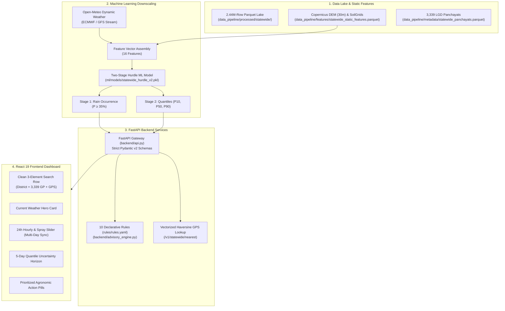

# TerraMind — Agentic AI & Graphify Setup Guide
> **The Authoritative Developer & Autonomous Agent Manual**  
> *How to configure Graphify as an AI agent tool, understand the TerraMind architecture, and develop on the codebase seamlessly.*

---

## 1. Executive Summary & Purpose

This guide is designed for **human developers** and **autonomous agentic AIs** (Google Antigravity, Claude Code, Cursor, Windsurf, Roo Code, Cline, and OpenAI Operator).

TerraMind is an enterprise-grade, statewide agro-meteorological downscaling platform covering all **3,339 Gram Panchayats** across the **22 rural districts** of West Bengal for Smart India Hackathon (Problem Statement SIH26074 — Ministry of Earth Sciences).

Because this codebase spans a **2.44M-row Apache Parquet data lake**, a **Two-Stage Hurdle Machine Learning downscaler**, a **FastAPI backend with Pydantic v2 strict typing**, and a **React 19 modular frontend**, traditional raw-file context dumping can exhaust agent token limits. **Graphify** solves this by converting the entire codebase into a persistent, queryable knowledge graph with AST symbols, semantic citations, and community clustering.

---

## 2. What is Graphify?

[Graphify](https://github.com/arnokai) is a code-intelligence engine that analyzes codebases, architecture documents, and data contracts to construct a persistent knowledge graph stored in `graphify-out/`:

```text
graphify-out/
├── graph.json        # Unified graph (nodes, edges, communities, AST symbols)
├── graph.html        # Interactive 3D/2D visual graph explorer
├── GRAPH_REPORT.md   # Architectural summary and god-node breakdown
└── wiki/
    └── index.md      # Auto-generated browsable markdown wiki
```

### Why Agents Use Graphify:
1. **Token Efficiency:** Instead of reading dozens of raw files, agents query scoped subgraphs (`graphify query`) returning only the relevant 5–15 symbols and relationships.
2. **Structural Discovery:** Explores call graphs (`A calls B`), data inheritance (`A shares_data_with B`), and cross-layer citations (`forecast_engine_v2.py -> statewide_hurdle_v2.pkl`).
3. **Free Incremental Maintenance:** Graph updates take **<2 seconds** using fast AST extraction without incurring any LLM API cost.

---

## 3. Step-by-Step Graphify Installation & Setup

### Step 3.1 — Install Graphify CLI

Install Graphify globally or within your project environment:

```bash
# Option A: Standard pip installation
pip install graphify-ai

# Option B: Isolated installation via pipx (recommended for multi-agent setups)
pipx install graphify-ai
```

Verify the installation:
```bash
graphify --version
```

---

### Step 3.2 — Configure Graphify for Your AI Agent Environment

#### A. Google Antigravity (AGY)
Antigravity automatically detects Graphify skills and rules in `.agents/rules/`:
```bash
# Install the Antigravity skill
graphify install --platform antigravity
```

#### B. Claude Code
Install the native Claude Code skill:
```bash
graphify install --platform claude
```

#### C. Cursor / Windsurf / Cline / Roo Code (Model Context Protocol - MCP)
Graphify provides a native MCP server for IDE agents. Add the following to your agent configuration:

**For Cursor (`.cursor/mcp.json` or Global Settings):**
```json
{
  "mcpServers": {
    "graphify": {
      "command": "graphify-mcp",
      "args": []
    }
  }
}
```

**For Windsurf / Roo Code / Cline (`mcp_settings.json`):**
```json
{
  "mcpServers": {
    "graphify": {
      "command": "python",
      "args": ["-m", "graphify.mcp_server"],
      "env": {}
    }
  }
}
```

---

### Step 3.3 — Agent Rules Configuration (`.agents/rules/graphify.md`)

To ensure autonomous agents consistently query the graph rather than searching blindly, maintain this rule file at `.agents/rules/graphify.md`:

```markdown
## graphify

This project has a graphify knowledge graph at graphify-out/.

Rules:
- For codebase or architecture questions, when `graphify-out/graph.json` exists, first run `graphify query "<question>"` (CLI) or `query_graph` (MCP).
- Use `graphify path "<A>" "<B>"` / `shortest_path` for relationships and `graphify explain "<concept>"` / `get_node` for focused concepts.
- If `graphify-out/wiki/index.md` exists, navigate it instead of reading raw files.
- Read `graphify-out/GRAPH_REPORT.md` only for broad architecture review or when query/path/explain do not surface enough context.
- After modifying code files in this session, run `graphify update .` to keep the graph current (AST-only, zero API cost).
```

---

### Step 3.4 — Generating & Updating the Knowledge Graph

```bash
# 1. Build the graph for the first time (parses Python, JS/JSX, Markdown, JSON)
graphify build .

# 2. Update the graph after editing code files (instant AST extraction, no LLM cost)
graphify update .

# 3. Watch mode (automatically updates in the background on every file save)
graphify watch .

# 4. Launch visual graph explorer in your browser
graphify serve
# Opens http://localhost:8080 displaying the interactive node-link network
```

---

### Step 3.5 — Agent Query Tool Cheat Sheet

| Command / Tool | Description | Example Agent Usage |
| :--- | :--- | :--- |
| `graphify query "<query>"` | Searches the graph for symbols, concepts, and relationships | `graphify query "how is the hurdle model loaded"` |
| `graphify path "<A>" "<B>"` | Discovers the shortest structural connection between two nodes | `graphify path "backend/api.py" "statewide_hurdle_v2.pkl"` |
| `graphify explain "<node>"` | Pulls the complete definition, callers, callees, and community | `graphify explain "HourlyWeather"` |
| `graphify update .` | Re-indexes modified files into the existing graph | Run immediately after making code changes |

---

## 4. How This Codebase Works (Developer & Agent Primer)



---

### 4.1 Layer 1: Data Pipeline & Data Lake
* **Location:** [`data_pipeline/`](file:///home/arnokai/Projects/SIH_Panchayat_Project/data_pipeline/)
* **Pure Apache Parquet Architecture:** Zero CSV runtime dependencies. All data is structured in Apache Parquet format.
* **Statewide Hive Partitions:** Located at `data_pipeline/processed/statewide/district_name=*/data.parquet` (22 rural districts, 2,440,809 rows).
* **Metadata Registry:** `data_pipeline/metadata/statewide_panchayats.parquet` maps all **3,339 Gram Panchayats** with official Local Government Directory (LGD) codes, block names, district names, and WGS84 coordinates.
* **Static Geospatial Features:** `data_pipeline/features/statewide_static_features.parquet` stores pre-computed 16-feature vectors for every Panchayat:
  * Copernicus 30m DEM elevation (`elevation_dem_m`), slope (`slope_deg`), aspect (`aspect_sin`, `aspect_cos`), terrain roughness (`terrain_roughness_m`), relative elevation delta (`relative_elevation_m`).
  * Nearest river distance (`distance_to_river_m`) from HydroSHEDS.
  * ISRIC SoilGrids sand %, clay %, silt %.

---

### 4.2 Layer 2: Machine Learning Downscaling Engine
* **Location:** [`ml/`](file:///home/arnokai/Projects/SIH_Panchayat_Project/ml/) and [`ml/models/statewide_hurdle_v2.pkl`](file:///home/arnokai/Projects/SIH_Panchayat_Project/ml/models/statewide_hurdle_v2.pkl) (1.54 MB).
* **Problem Solved:** Coarse global meteorological models (ECMWF/GFS) operate at ~25–50 km grid resolutions. TerraMind downscales precipitation to the individual Gram Panchayat (~2–5 km) based on localized terrain, elevation, and soil physics.
* **Two-Stage Hurdle Architecture:**
  1. **Stage 1 (Binary Occurrence Hurdle):**
     * Model: `HistGradientBoostingClassifier`
     * Predicts whether rainfall will occur ($P(\text{Rain} \ge 0.1\text{ mm})$).
  2. **Stage 2 (Quantile Continuous Regressors):**
     * Model: 3 parallel `HistGradientBoostingRegressor` models trained on wet days with quantile pinball loss.
     * Generates monotonic uncertainty bands:
       * **P10 (Minimum Dry Bound)**
       * **P50 (Median Expected Rainfall)**
       * **P90 (Maximum Severe Weather Bound)**
     * Strict physical monotonicity enforced: $0.0 \le P10 \le P50 \le P90$.
* **Holdout Validation Metrics (2025 Test Horizon):**
  * Accuracy: **99.39%**
  * ROC-AUC: **0.9999**
  * Probability of Detection (POD): **99.49%**
  * False Alarm Rate (FAR): **0.80%**
  * Mean Absolute Error (MAE): **0.56 mm**

---

### 4.3 Layer 3: FastAPI Backend Services
* **Location:** [`backend/`](file:///home/arnokai/Projects/SIH_Panchayat_Project/backend/)
* **Application Gateway ([`backend/api.py`](file:///home/arnokai/Projects/SIH_Panchayat_Project/backend/api.py)):**
  * High-throughput asynchronous FastAPI service.
  * Open CORS enabled for multi-client web, mobile, and KVK consumption.
  * Auto-generated interactive Swagger UI at `/docs`.
* **Forecast Engine ([`backend/forecast_engine_v2.py`](file:///home/arnokai/Projects/SIH_Panchayat_Project/backend/forecast_engine_v2.py)):**
  * Ingests live ECMWF/GFS weather via Open-Meteo with an in-memory 15-minute TTL cache (`_LIVE_WEATHER_CACHE`).
  * Graceful fallback: If network is unreachable, automatically falls back to offline Parquet baseline with `degraded: true`.
  * Real-time inference: Loads `statewide_hurdle_v2.pkl` in memory and executes downscaling in **<15 ms per Panchayat**.
* **Strict Pydantic v2 Schemas ([`backend/schemas/models.py`](file:///home/arnokai/Projects/SIH_Panchayat_Project/backend/schemas/models.py)):**
  * Strict request/response validation ensuring schema compliance.
  * `HourlyWeather` exposes `records` (rolling 24h) and `all_records` (complete 120-hour multi-day dataset).
* **Advisory Rules Engine ([`backend/advisory_engine.py`](file:///home/arnokai/Projects/SIH_Panchayat_Project/backend/advisory_engine.py) & [`rules/rules.yaml`](file:///home/arnokai/Projects/SIH_Panchayat_Project/rules/rules.yaml)):**
  * Evaluates 10 declarative rules prioritizing farmer advice:
    * `no_spray_rain` (>20 mm: chemical spray prohibition)
    * `heat_stress` (>38°C during flowering)
    * `blast_disease_risk` (humidity >85% for ≥3 days on paddy)
    * `sandy_soil_dry_spell` (dry days ≥7 on sandy soil)
    * `harvest_rain` (rain >0 during harvest window)
    * `moderate_rain`, `light_rain`, `dry_day`, `chemical_spray_safe_window`, `sheath_blight_risk`.
  * Multi-crop phenology calendar support: **Paddy, Potato, Mustard, Jute, and Vegetables**.
* **Vectorized GPS Lookup (`GET /v1/statewide/nearest`):**
  * Vectorized Haversine spherical distance calculation across all 3,339 GPs in <15 ms.

---

### 4.4 Layer 4: React 19 Frontend Dashboard
* **Location:** [`frontend/`](file:///home/arnokai/Projects/SIH_Panchayat_Project/frontend/)
* **Framework:** React 19 (`^19.2.8`) + Vite 8 (`^8.2.2`).
* **Clean Single-Responsibility Components:**
  * [`src/App.jsx`](file:///home/arnokai/Projects/SIH_Panchayat_Project/frontend/src/App.jsx): Root state coordinator, date synchronization, and `localStorage` preference memory.
  * [`src/components/SearchBar.jsx`](file:///home/arnokai/Projects/SIH_Panchayat_Project/frontend/src/components/SearchBar.jsx): 3-element header row with District filter dropdown, 3,339 GP debounced autocomplete, and 1-click GPS auto-detect button.
  * [`src/components/CurrentWeatherHero.jsx`](file:///home/arnokai/Projects/SIH_Panchayat_Project/frontend/src/components/CurrentWeatherHero.jsx): Hero weather overview with live/offline toggle, crop pills, and atmospheric telemetry.
  * [`src/components/HourlyWeatherSlider.jsx`](file:///home/arnokai/Projects/SIH_Panchayat_Project/frontend/src/components/HourlyWeatherSlider.jsx): Google-style 24-hour horizontal carousel dynamically synchronized with the selected forecast day (Today, Tomorrow, Day +2, Day +3, Day +4). Includes 3 metric tabs (Temperature, Rain Chance, Spray Safety) and an auto-synthesized operational farm advice banner.
  * [`src/components/WeatherIcon.jsx`](file:///home/arnokai/Projects/SIH_Panchayat_Project/frontend/src/components/WeatherIcon.jsx): Pure inline vector SVG weather icons guaranteeing zero broken images and complete offline reliability.
  * [`src/components/QuantileForecastList.jsx`](file:///home/arnokai/Projects/SIH_Panchayat_Project/frontend/src/components/QuantileForecastList.jsx): 5-day horizon cards with P10/P50/P90 quantile uncertainty bars and actionable decision chips.
  * [`src/components/AgronomicAlerts.jsx`](file:///home/arnokai/Projects/SIH_Panchayat_Project/frontend/src/components/AgronomicAlerts.jsx): Prioritized agricultural advisory alerts with high-contrast warning badges.
  * [`src/components/SystemStatsFooter.jsx`](file:///home/arnokai/Projects/SIH_Panchayat_Project/frontend/src/components/SystemStatsFooter.jsx): System telemetry footer verifying 2.44M rows, 3,339 GPs, and QA status.

---

## 5. Development & Testing Cheatsheet

### 5.1 Environment Setup
```bash
# 1. Setup Python Virtual Environment
python3 -m venv .venv
source .venv/bin/activate
pip install -r requirements.txt

# 2. Setup Frontend Dependencies
cd frontend
npm install
cd ..
```

### 5.2 Starting the Servers
```bash
# Terminal 1 — Backend (FastAPI on Port 8000)
uvicorn backend.api:app --reload --port 8000

# Terminal 2 — Frontend (Vite on Port 5173)
npm --prefix frontend run dev -- --host 127.0.0.1 --port 5173
```

### 5.3 Automated Verification (Must Pass 100%)
```bash
# 1. Run complete Python test suite (161 unit tests)
python -m unittest discover tests

# 2. Run frontend lint and production build
npm --prefix frontend run lint
npm --prefix frontend run build

# 3. Update the Graphify knowledge graph
graphify update .
```

---

## 6. Graphify Knowledge Graph Summary for This Repository

```text
Nodes: 934
Edges: 1183
Communities: 83
Key Hubs:
├── backend/api.py                      (FastAPI REST Endpoints)
├── backend/forecast_engine_v2.py       (Weather Ingestion & Hurdle Downscaling)
├── backend/advisory_engine.py          (Declarative Agronomic Rules Engine)
├── backend/schemas/models.py           (Strict Pydantic v2 Models)
├── ml/models/statewide_hurdle_v2.pkl   (Trained Two-Stage Hurdle Model)
├── data_pipeline/metadata/             (3,339 Statewide LGD Panchayats)
└── frontend/src/App.jsx                (React 19 Dashboard Coordinator)
```
